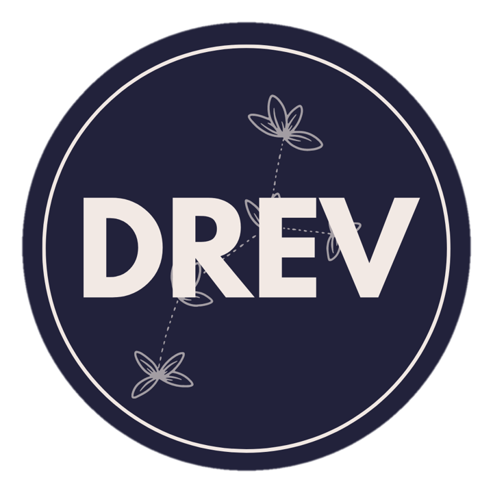

[![Contributors][contributors-shield]][contributors-url]
[![Forks][forks-shield]][forks-url]
[![Stargazers][stars-shield]][stars-url]
[![Issues][issues-shield]][issues-url]
[![MIT License][license-shield]][license-url]
[![LinkedIn][linkedin-shield]][linkedin-url]

<!-- PROJECT LOGO -->
<br />
<p align="center">
  <a href="https://github.com/wevertonbruno/blog-nextjs">
    
  </a>

  <h3 align="center">Direito Reinventado Blog Acadêmico</h3>

  <p align="center">
    Frontend of a BLOG with NextJS, ReactJS, Typescript and Styled-Components
    <br />
    <a href="https://github.com/wevertonbruno/blog-nextjs">View Demo</a>
    ·
    <a href="https://github.com/wevertonbruno/blog-nextjs/issues">Report Bug</a>
    ·
    <a href="https://github.com/wevertonbruno/blog-nextjs/issues">Request Feature</a>
  </p>
</p>


<!-- TABLE OF CONTENTS -->
<details open="open">
  <summary>Table of Contents</summary>
  <ol>
    <li>
      <a href="#about-the-project">About The Project</a>
      <ul>
        <li><a href="#built-with">Built With</a></li>
      </ul>
    </li>
    <li>
      <a href="#getting-started">Getting Started</a>
      <ul>
        <li><a href="#prerequisites">Prerequisites</a></li>
        <li><a href="#installation">Installation</a></li>
      </ul>
    </li>
    <li><a href="#usage">Usage</a></li>
    <li><a href="#roadmap">Roadmap</a></li>
    <li><a href="#contributing">Contributing</a></li>
    <li><a href="#license">License</a></li>
    <li><a href="#contact">Contact</a></li>
  </ol>
</details>


<!-- ABOUT THE PROJECT -->
## About The Project


This project is a frontend of a blog with academical purposes. The blog will be rendered via server side, and will consume a API Rest build in Java with Spring Framework.

### Built With

This section should list any major frameworks that you built your project using. Leave any add-ons/plugins for the acknowledgements section. Here are a few examples.
* [NextJS](https://nextjs.org/)
* [ReactJS](https://reactjs.org/)
* [Typescript](https://www.typescriptlang.org/)
* [Styled-components](https://styled-components.com/)


<!-- GETTING STARTED -->
## Getting Started

This is an example of how you may give instructions on setting up your project locally.
To get a local copy up and running follow these simple example steps.

### Prerequisites

This is an example of how to list things you need to use the software and how to install them.
* yarn
  ```sh
  npm install --global yarn
  ```

### Installation

1. Clone the repo
   ```sh
   git clone https://github.com/wevertonbruno/blog-nextjs.git
   ```
2. Install NPM packages
   ```sh
   yarn install
   ```
3. Run project in dev mode
   ```sh
   yarn dev
   ```


<!-- USAGE EXAMPLES -->
## Usage

Use this space to show useful examples of how a project can be used. Additional screenshots, code examples and demos work well in this space. You may also link to more resources.

_For more examples, please refer to the [Documentation](https://example.com)_


<!-- ROADMAP -->
## Roadmap

See the [open issues](https://github.com/wevertonbruno/blog-nextjs/issues) for a list of proposed features (and known issues).


<!-- CONTRIBUTING -->
## Contributing

Contributions are what make the open source community such an amazing place to learn, inspire, and create. Any contributions you make are **greatly appreciated**.

1. Fork the Project
2. Create your Feature Branch (`git checkout -b feature/AmazingFeature`)
3. Commit your Changes (`git commit -m 'Add some AmazingFeature'`)
4. Push to the Branch (`git push origin feature/AmazingFeature`)
5. Open a Pull Request


<!-- LICENSE -->
## License

Distributed under the MIT License. See `LICENSE` for more information.


<!-- CONTACT -->
## Contact

Weverton Bruno - [@oieusouweverton](https://twitter.com/oieusouweverton) - oieusouweverton@hotmail.com

Project Link: [https://github.com/wevertonbruno/blog-nextjs](https://github.com/wevertonbruno/blog-nextjs)


[contributors-shield]: https://img.shields.io/github/contributors/wevertonbruno/blog-nextjs.svg?style=for-the-badge
[contributors-url]: https://github.com/wevertonbruno/blog-nextjs/graphs/contributors
[forks-shield]: https://img.shields.io/github/forks/wevertonbruno/blog-nextjs.svg?style=for-the-badge
[forks-url]: https://github.com/wevertonbruno/blog-nextjs/network/members
[stars-shield]: https://img.shields.io/github/stars/wevertonbruno/blog-nextjs.svg?style=for-the-badge
[stars-url]: https://github.com/wevertonbruno/blog-nextjs/stargazers
[issues-shield]: https://img.shields.io/github/issues/wevertonbruno/blog-nextjs.svg?style=for-the-badge
[issues-url]: https://github.com/wevertonbruno/blog-nextjs/issues
[license-shield]: https://img.shields.io/github/license/wevertonbruno/blog-nextjs.svg?style=for-the-badge
[license-url]: https://github.com/wevertonbruno/blog-nextjs/blob/main/LICENSE.txt
[linkedin-shield]: https://img.shields.io/badge/-LinkedIn-black.svg?style=for-the-badge&logo=linkedin&colorB=555
[linkedin-url]: https://linkedin.com/in/oieusoweverton/
[product-screenshot]: 
